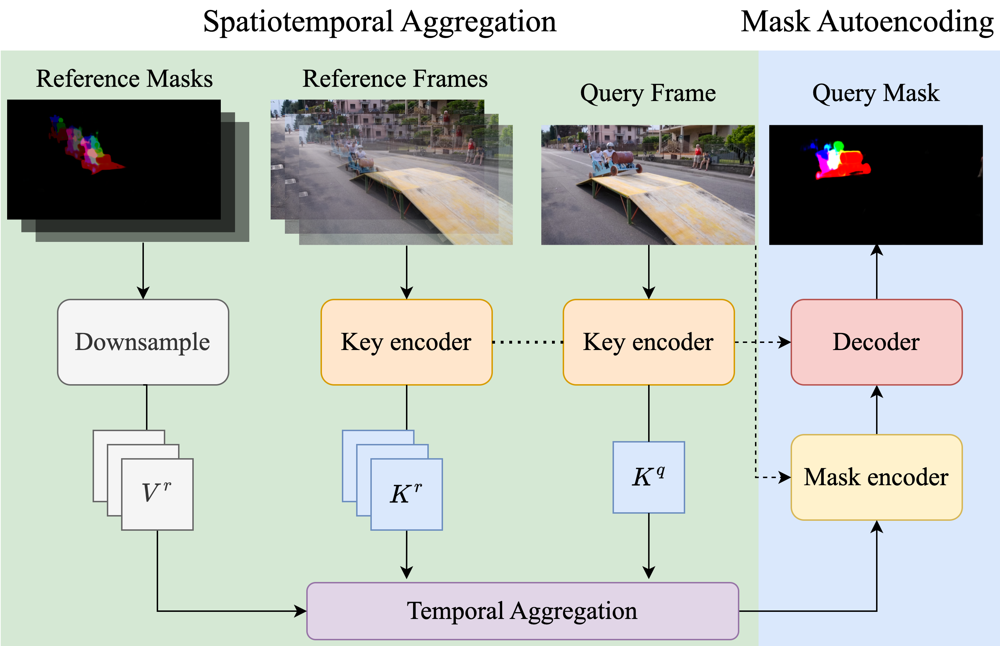
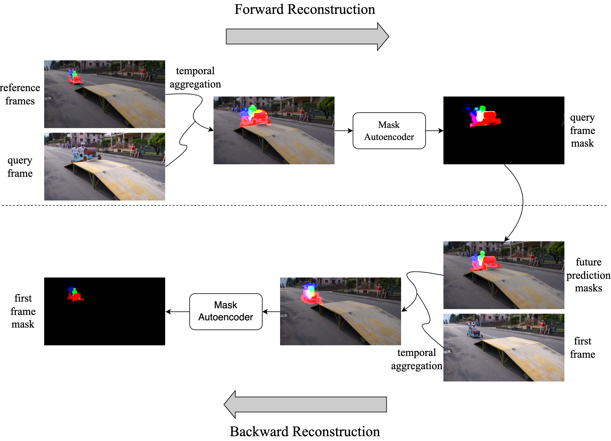

[](https://opensource.org/licenses/MIT)
[](https://pytorch.org/)

# STMAE
## A Spatiotemporal Mask Autoencoder for One-shot Video Object Segmentation
[Baiyu Chen](https://supgb.github.io) $^1$, Li Zhao $^1$, Sixian Chan $^2$

$^1$ Key Laboratory of Intelligent Informatics for Safety & Emergency of Zhejiang Province, Wenzhou University<br>
$^2$ The College of Computer Science and Technology, Zhejiang University of Technology

[FAIML 2024](www.faiml.org)

## DEMO  
<div style="display: flex; justify-content: space-between;">
    
    
</div>

## Features
- A label-efficient VOS network based on autoencoding.
- Achieve comparable results with fully-supervised VOS approaches using only the first frame annotations of videos.

## Table of Contents
1. [Introduction](#introduction)
1. [Results](#results)
1. [Getting Started](#getting-started)
1. [Training](#training)
1. [Inference](#inference)
1. [Citation](#citation)

## Introduction

The above figure depicts the structure of STMAE, consisting of a key encoder and a mask autoencoder (mask encoder & decoder). The key encoder captures the spatiotemporal correspondences between reference frames and the query frame, and aggregates a coarse mask for the query frame according to the captured correspondences. Next, the mask autoencoder is responsible for reconstruct a clear prediction mask from the coarse one.


The above figure illustrates the simple idea of the One-shot Training strategy. A forward reconstruction operation is first taken to obtain the predictions of subsquent frames under the *stop gradient* setting, and with gradients being calculated a backward reconstruction operation is used to rebuild the first frame mask by using predictions of subsquent frames.

## Results
$^*$ *The results here are improved caused we've updated our implementation.*

| Dataset |  J&F | J | F | Label % | Train on
| --- | :--:|:--:|:---:|:---:|:---:|
| DAVIS 2016 val. | 87.3 | 87.2 | 87.5 | 3.5 | DAVIS 2017 + YouTube-VOS 2018 |
| DAVIS 2017 val. | 79.6 | 76.7 | 82.5 | 3.5 | DAVIS 2017 + YouTube-VOS 2018 |

| Dataset | Overall Score | J-Seen | F-Seen | J-Unseen | F-Unseen | Label % | Train on
| --- | :--:|:--:|:---:|:---:|:---:|:---:|:---:|
| YouTubeVOS 18 val. | 71.8 | 75.7 | 79.6 | 62.2 | 69.7 | 3.5 % | DAVIS 2017 + YouTube-VOS 2018 |

## Getting Started
To reproduce our results, you can either train the model following [Training](#training) or evaluate our [pretrained model](https://github.com/Supgb/STMAE/releases/tag/v1.0) following the instruction in [Inference](#inference). Before you start, the experiments environment can be configured using `conda` and `pip`.

### Clone the repository
```bash
git clone https://github.com/Supgb/STMAE.git && cd STMAE
```
### Create the environment using `conda`
```bash
conda create -n stmae python=3.8
conda activate stmae
```
### Install the dependencies using `pip`
```bash
pip install -r requirements.txt
```
### Download the datasets
```bash
python -m scripts.download_datasets
```
If datasets are already in your machine, you should use softlink (`ln -s`) to organize their structures as following:
```bash
├── STMAE
├── DAVIS
│   ├── 2016
│   │   ├── Annotations
│   │   └── ...
│   └── 2017
│       ├── test-dev
│       │   ├── Annotations
│       │   └── ...
│       └── trainval
│           ├── Annotations
│           └── ...
├── static
│   ├── BIG_small
│   └── ...
├── YouTube
│   ├── all_frames
│   │   └── valid_all_frames
│   ├── train
│   ├── train_480p
│   └── valid
└── YouTube2018
    ├── all_frames
    │   └── valid_all_frames
    └── valid
```
## Training
Our experiments are conducted using a batch size of 32 with 4 NVIDIA Tesla V100 GPUs. But we have tested that using a smaller batch size (incorperating the linear learning rate scaling) or less GPUs can deliver similar performances. The following command can be used to train our model from scratch:
```bash
torchrun --nnodes=1 --nproc_per_node=4 --rdzv_id=100 --rdzv_backend=c10d --rdzv_endpoint=[address:port] train.py --stage 3 --s3_batch_size 32 --s3_lr 2e-5 --s3_num_frames 8 --s3_num_ref_frames 3 --exp_id [identifier_for_exp] --val_epoch 5 --total_epoch 350
```
If you prefer a pretrained model for fine-tuning, please use the flag `--load_network` followed by the `path-to-the-pretrained-model`

## Inference
To evaluate the trained model on DAVIS 2016/2017 or YouTube-VOS 2018/2019, the model should first inference on the dataset. Next, the qualitation results can be obtained by following the corresponding evaluation instructions of datasets, *i.e.,* [vos-benchmark](https://github.com/hkchengrex/vos-benchmark) for DAVIS dataset or evaluation servers for YouTube-VOS ([2018 CondaLab](https://competitions.codalab.org/competitions/19544#results) & [2019 CondaLab](https://competitions.codalab.org/competitions/20127#participate-submit_results)).

Given a model, the inference command is following:
```bash
python eval.py --model [path-to-model] --output outputs/[d16/d17/y18/y19] --dataset [D16/D17/Y18/Y19]
```

## Citation
TBD

## Acknowledgements
We thank PyTorch contributors and [Ho Kei Cheng](https://hkchengrex.github.io/) for releasing their implementation of [XMem](https://github.com/hkchengrex/XMem) and [STCN](https://github.com/hkchengrex/STCN).
